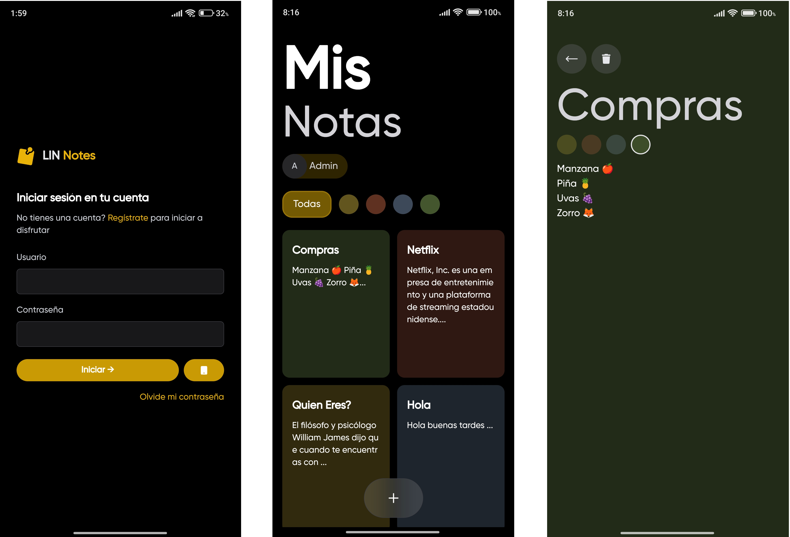
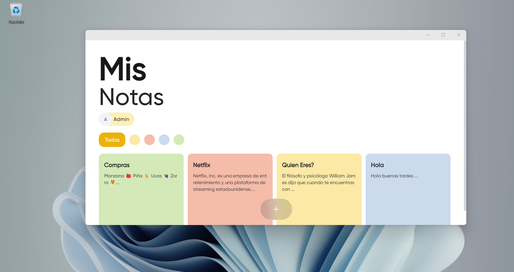
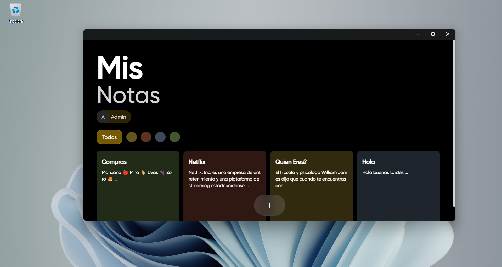

  

    
  

  
La aplicación Notas App es una aplicación multiplataforma desarrollada en .NET MAUI que permite a los usuarios crear, gestionar y sincronizar notas entre dispositivos Windows y Android. Con una interfaz intuitiva y características como la capacidad de cambiar colores de las notas, esta aplicación proporciona una experiencia fácil y cómoda para el manejo de tus notas diarias.

 

    
    
  

## Características

* **Creación de Notas** Crea fácilmente nuevas notas con solo unos pocos clics o toques.
* **Sincronización** Sincroniza tus notas entre dispositivos Windows y Android para acceder a ellas en cualquier momento y en cualquier lugar.
* **Cambiar Colores** Personaliza el aspecto de tus notas cambiando los colores según tu preferencia.
* **Interfaz Intuitiva** Una interfaz de usuario simple y fácil de usar que hace que la gestión de notas sea rápida y eficiente.
* Esta es una app **Local First**.

## Capturas

### Modo Claro

### Modo Oscuro

## Capturas

### Modo Claro

### Modo Oscuro
